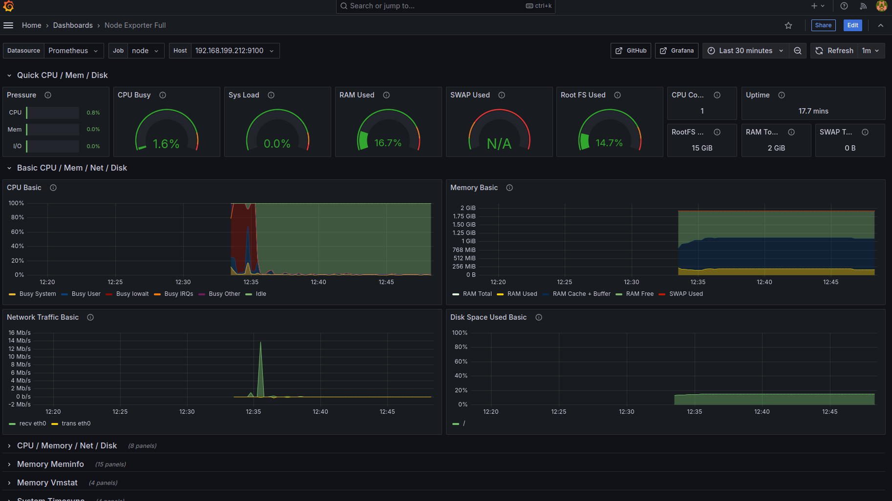
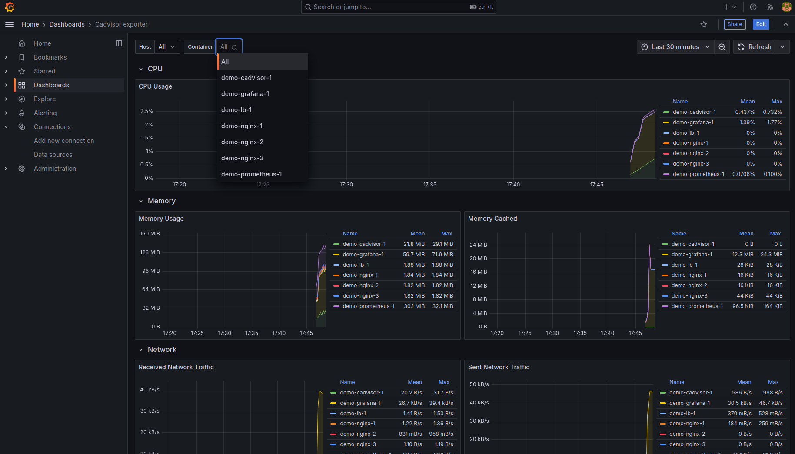

# Grafana + Prometheus + Node exporter на **Ubuntu 24.04 LTS**
## 1.1. Manual deployment (openstack cli)

### Предварительные условия:
1. Подготовить локально openstack cli (по [инструкции](https://docs.selectel.ru/en/cloud/servers/tools/openstack/))
2. Создать сервисный аккаунт с ролями (по инструкции):
   1. Администратор аккаунта
   2. Администратор проекта ```<project-name>```
   3. Администратор пользователей

### Шаги выполнения:
```
#!/bin/bash

# Create net + subnet + router + ports
openstack network create network_1
openstack subnet create subnet_1 --network network_1 --subnet-range 192.168.199.0/24
openstack router create router_1
openstack router set router_1 --external-gateway external-network
openstack router add subnet router_1 subnet_1
for val in {1..3}; do openstack port create -q --network network_1 --fixed-ip subnet=subnet_1,ip-address=192.168.199.4${val} port${val}; done
openstack floating ip create -q external-network --port port1

# Create 3 volumes
image="b671a80e-9bf0-4861-9833-bd711bd8a02f" # Ubuntu 24.04
for val in {1..3}; do openstack volume create -q --image ${image} --size 10 --type basic.ru-9a --availability-zone ru-9a boot-volume-${val}; done

# Create 3 VMs
ssh-keygen -t ed25519 -f "$HOME/.ssh/virt" -q -N ""
openstack keypair create --public-key "$HOME/.ssh/virt" keypair_1

flavor='1012'
for val in {1..3}; do
  openstack server create server_"${val}" \
  --flavor ${flavor} \
  --volume boot-volume-"${val}" \
  --port port"${val}" \
  --key-name keypair_1 \
  --availability-zone ru-9a;
done
```
## 1.2 Automatic deployment (Terraform):
### Предварительные шаги:
1. Подготовить локально Terraform (по [инструкции](https://docs.selectel.ru/terraform/quickstart/))
2. Создать сервисный аккаунт с ролями (по инструкции):
   1. Администратор аккаунта
   2. Администратор проекта ```<project-name>```
   3. Администратор пользователей
4. Указать переменные **своими** значениями в файле `./1.Terraform/_vars.tf`
   + selectel-domain
   + selectel-project-id
   + service-account-main-name
   + service-account-main-password
   + service-account-main-id
5. Сгенерировать ssh-ключ, который будет использоваться для доступа к виртуальным машинам:
   ```
   ssh-keyen -t ed25519 -f ~/.ssh/virt
   ```

### Шаги выполнения:
1. Развернуть окружение:
    ```
   git clone git@github.com:PrometheRus/Sehenswurdigkeiten.git
   cd Sehenswurdigkeiten/Grafana/1.Terraform/
   terraform fmt && terraform validate
   terraform plan
   terraform apply
    ```
**После** выполнения будут созданы 4 ВМ. В выводе команды будут указаные приватные (4 шт) и публичные (2 шт) адреса машин.

## 2. Provisioning (настройка кластера через Ansible):
### Предварительные шаги:
1. Установить anisble-core
### Шаги выполнение
2. Перейти в директорию с плейбуком:
   ```
   cd Sehenswurdigkeiten/Grafana/2.Ansible/ 
   ```
3. 3 приватные адреса и 1 публичный адрес ручками добавить в  ```hosts.ini```
   ```
   vi hosts.init
   ```
4. Копируем ранее сгенерированный ssh-ключ и ssh-config на машину-бастион (замените в команде IP) для доступа к виртуальным машинам:
```
tee root_config > /dev/null <<EOF
Host *
 IdentityFile ~/.ssh/virt
 StrictHostKeyChecking no
EOF
chmod 600 root_config
bastion_ip={{ REPLACE ME}}
rsync ~/.ssh/virt root@"${bastion_ip}":/root/.ssh
rsync ./root_config root@"${bastion_ip}":/root/.ssh/config
rm -f ./root_config
```
5. Запустить плейбук:
   ```
   ansible-playbook playbook.yml
   ```
6. Настроить дашборд:
   1. Переходим на публичный адрес машины **grafana** ``<IP-address>:3000``, логинимся под ``admin:admin``, устанавливаем новый админский пароль
   2. В разделе **/dashboards** импортируем дашборд **1860**

**Результат: доступен дашборд с системными метриками с возможностью выбора из 3х машин**


### Моя графана доступна по [ссылке](http://87.228.27.130:3000/d/rYdddlPWk/node-exporter-full). Креды: **viewer:viewer**, доступ из под 188.93.16.0/22 (могу открыть еще при необходимости)

## 3. Docker-compose:
Терраформ уже развернул машину **docker**. Дополнительные действия по подготовке не требуются.

1. Заходим по **ssh** на машину ``<public_ip_address_docker>`` и запускаем:
```
docker compose -p demo up
...
root@docker:~# docker compose -p demo ps
NAME                IMAGE                      COMMAND                  SERVICE      CREATED         STATUS                   PORTS
demo-cadvisor-1     gcr.io/cadvisor/cadvisor   "/usr/bin/cadvisor -…"   cadvisor     6 minutes ago   Up 6 minutes (healthy)   0.0.0.0:8080->8080/tcp, :::8080->8080/tcp
demo-grafana-1      grafana/grafana            "/run.sh"                grafana      6 minutes ago   Up 6 minutes             0.0.0.0:3000->3000/tcp, :::3000->3000/tcp
demo-lb-1           nginx                      "/docker-entrypoint.…"   lb           6 minutes ago   Up 6 minutes             80/tcp, 0.0.0.0:8888->8888/tcp, :::8888->8888/tcp
demo-nginx-1        nginx                      "/docker-entrypoint.…"   nginx        6 minutes ago   Up 6 minutes             80/tcp
demo-nginx-2        nginx                      "/docker-entrypoint.…"   nginx        6 minutes ago   Up 6 minutes             80/tcp
demo-nginx-3        nginx                      "/docker-entrypoint.…"   nginx        6 minutes ago   Up 6 minutes             80/tcp
demo-prometheus-1   prom/prometheus            "/bin/prometheus --c…"   prometheus   6 minutes ago   Up 6 minutes             0.0.0.0:9090->9090/tcp, :::9090->9090/tcp
```
2. Проверяем по ``<public_ip_address_docker>:3000``, что Grafana поднялась
3. Импортируем ручками дашборд **14282**

**Результат: доступен дашборд с системными метриками с возможностью выбора из 7ми контейнеров**
